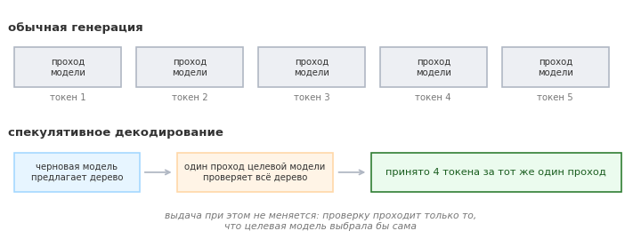
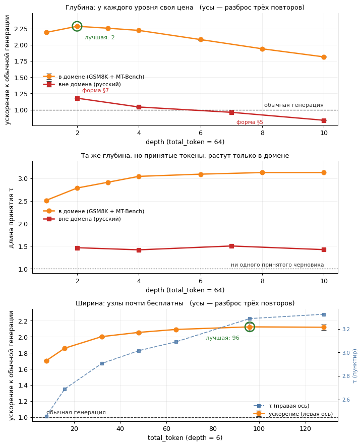

# EAGLE-3 на Qwen3: где спекулятивное декодирование ускоряет, а где мешает

Воспроизведение [EAGLE-3](https://arxiv.org/abs/2503.01840) (Li, Wei, Zhang, Zhang — NeurIPS 2025) на Qwen3-1.7B и Qwen3-4B, на бесплатной Kaggle T4. Статья заявляет ускорение до 6.5×; я разобрал метод по частям и померил каждую — включая режимы, в которых он проигрывает обычной генерации.

Разбор вышел двумя ноутбуками:

| | Ноутбук | Язык | Копия здесь |
|---|---|---|---|
| 🇷🇺 | [EAGLE-3 Qwen3-1.7B speculative decoding](https://www.kaggle.com/code/georgymamarin/eagle-3-qwen3-1-7b-speculative-decoding) | русский | [`.ipynb`](notebooks/ru/eagle3-qwen3.ipynb) · [`.pdf`](notebooks/ru/eagle3-qwen3.pdf) |
| 🇬🇧 | [Anatomy of a Speedup: EAGLE-3 on Qwen3](https://www.kaggle.com/code/georgymamarin/anatomy-of-a-speedup-eagle-3-on-qwen3) | английский | [`.ipynb`](notebooks/en/eagle3-qwen3-en.ipynb) · [`.pdf`](notebooks/en/eagle3-qwen3-en.pdf) |

<p align="center">
  
</p>

## Что измерено

Всё ниже снято на одной карте, при жадном декодировании и batch = 1, с повторами и разбросом.

**Домен решает больше, чем что-либо ещё.** Одна и та же черновая голова даёт разброс от ускорения в два с половиной раза до замедления:

| Набор | Длина принятия τ | Ускорение |
|---|---|---|
| HumanEval | 3.82 | 2.56× |
| GSM8K | 3.68 | 2.50× |
| Alpaca | 3.19 | 2.15× |
| MT-Bench | 2.91 | 1.97× |
| Русскоязычный | 1.38 | **0.95×** |

Итого по пяти наборам: τ = 3.00, ускорение 2.03× к `naivegenerate` и 1.81× к штатному `generate`.

**Замедление на чужом домене — свойство не языка, а связки «чужой домен плюс глубокое дерево».** Тот же срез по глубине, снятый на русскоязычном наборе, пересекает единицу:

| Глубина дерева | 2 | 4 | 7 | 10 |
|---|---|---|---|---|
| Ускорение | 1.18× | 1.04× | 0.96× | 0.84× |
| Длина принятия | 1.47 | 1.42 | 1.50 | 1.42 |

Длина принятия при этом стоит на месте: черновик угадывает одинаково редко на всех глубинах, меняется только цена. Строка в таблице выше (0.95×) снята на стартовой форме дерева `60/7/10`, то есть на глубине 7, и сходится с этим срезом.

<p align="center">
  
</p>

**Почему метод вообще работает.** Проход целевой модели не дорожает вплоть до 192 токенов, поэтому проверка целого дерева стоит примерно как генерация одного токена. Обычный шаг при этом вчетверо дороже теоретического минимума (43.5 против 10.8 мс), шина памяти загружена на четверть. Часть выигрыша метода — амортизация чужой неоптимальности, а не победа над памятью.

**Разбор цикла по фазам** (дерево `64/2/10`): проверка 45.4 мс, черновики 9.0 мс, выбор пути 0.4 мс, остальное 1.4 мс — против 46.1 мс обычного шага. Проверка стоит почти ровно один обычный шаг, но приносит два с половиной токена вместо одного.

**Ветвление против цепочки** той же глубины: +39% к длине принятия.

**Масштаб покупает длину принятия, но не скорость.** Тот же протокол на Qwen3-4B: τ растёт на 9.2% (воспроизводимо на восьми прогонах), а ускорение сдвигается в пределах пары процентов и меняет знак от прогона к прогону. Черновая голова растёт вместе с целью — 137 млн параметров против 218 млн.

**Метод не портит выдачу, и я проверил это тремя способами.** При T = 0 выдача совпадает потокенно, а редкие расхождения приходятся строго на позиции, где два верхних токена неразличимы по логиту. При T = 1 перестановочный тест не отвергает равенство распределений, причём с контролем на двух выборках обычной генерации. И прямое сравнение: распределение, из которого берётся первый токен, совпадает бит в бит.

## Что в репозитории

```
build_notebook.py       единственный источник правды для русского ноутбука
build_notebook_en.py    то же для английского
notebooks/ru, /en       опубликованный прогон: .ipynb с выводами, PDF со скрытым
                        служебным кодом, key_numbers.json для сверки
kernel/ru, /en          метаданные ядра; сюда билдер кладёт собранный .ipynb
tools/                  проверки, без которых числа в тексте разъезжаются с расчётом
figures/                фигуры последнего прогона
```

Ноутбук собирается скриптом, а не правится вручную: править ноутбук = править билдер и пересобрать. Причина простая — за время работы текст правился десятки раз, и без единого источника правды версии разъехались бы.

## Проверки

Четыре инструмента: каждый появился после того, как очередной дефект дожил до публикации.

**`tools/tools_reconcile.py`** сверяет числа, зашитые в прозу, с `key_numbers.json`, который ноутбук пишет сам. Проверяет не только значения, но и **утверждения как булевы условия**: «цикл дорожает быстрее шага», «вне домена осталось выше 1.0», «разброс τ между повторами нулевой». Значения могут сойтись по допуску, а знак сравнения — перевернуться; так вывод в разделе про масштабирование дважды переворачивался.

**`tools/tools_cellcheck.py`** идёт по ячейкам в порядке исполнения, собирает всё, что каждая вводит в пространство имён, и находит имена, использованные до определения. Ловит класс ошибок, который переживает и вычитку, и локальный рендер фигуры, но валит прогон на Kaggle.

**`tools/tools_preflight.py`** не даёт пушу вернуть опубликованный ноутбук в приватные: локальные метаданные легко остаются со старым `is_private: true`.

**Preflight внутри билдера** падает до записи файла, если пропали обратные кавычки, разошлись ограждения кода, появился form feed или сломалась внутренняя ссылка.

## Воспроизвести

Форкните любой из ноутбуков на Kaggle и поменяйте в §0 две строки из четырёх — целевую модель и черновую голову; наборы запросов, таблицы и графики пересоберутся под них. Нужен GPU T4 и включённый интернет; полный прогон занимает около 40 минут.

Локально:

```bash
python3 build_notebook.py                                    # собрать ноутбук из билдера
python3 tools/tools_cellcheck.py kernel/ru/eagle3-qwen3.ipynb
python3 tools/tools_preflight.py kernel/ru && kaggle kernels push -p kernel/ru
```

Сверить прозу с числами прогона — на опубликованном прогоне или на своём, выгруженном из Kaggle:

```bash
python3 tools/tools_reconcile.py notebooks/ru/key_numbers.json
kaggle kernels output georgymamarin/eagle-3-qwen3-1-7b-speculative-decoding -p /tmp/out
python3 tools/tools_reconcile.py /tmp/out/key_numbers.json
```

Официальный репозиторий EAGLE я сюда не кладу: ноутбук клонирует его сам на зафиксированном коммите `cb7e0841`.

## Веса

Обе черновые головы обучены командой [AngelSlim](https://github.com/Tencent/AngelSlim) (Tencent), а не авторами EAGLE. Для Kaggle я зеркалировал их как модели — веса побитово совпадают с оригиналом на Hugging Face:

- [qwen3-1-7b-eagle3-draft-head](https://www.kaggle.com/models/georgymamarin/qwen3-1-7b-eagle3-draft-head) ← [AngelSlim/Qwen3-1.7B_eagle3](https://huggingface.co/AngelSlim/Qwen3-1.7B_eagle3)
- [qwen3-4b-eagle3-draft-head](https://www.kaggle.com/models/georgymamarin/qwen3-4b-eagle3-draft-head) ← [AngelSlim/Qwen3-4B_eagle3](https://huggingface.co/AngelSlim/Qwen3-4B_eagle3)

В разборе есть одна правка официального кода, и она оговорена в тексте: `cnets.py` выводит ширину головы внимания из скрытого размера и потому не загружает голову Qwen3-4B (32 головы × 128 = 4096 против 2560). Три строки в ячейке окружения берут `head_dim` из конфига; для пары 1.7B это ничего не меняет.

## Лицензии

Код разбора — Apache 2.0. Реализация EAGLE ([SafeAILab](https://github.com/SafeAILab/EAGLE)) — Apache 2.0. Веса черновых голов и целевых моделей сохраняют свои лицензии. Наборы запросов (MT-Bench, GSM8K, HumanEval, Alpaca) взяты из репозитория статьи — те же, на которых считают авторы.
